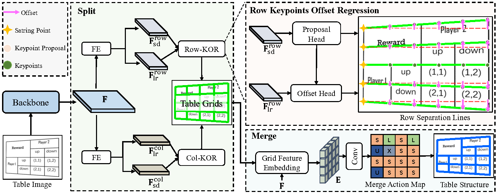

# SEMv3: A Fast and Robust Approach to Table Separation Line Detection

This repository contains the source code of [SEMv3: A Fast and Robust Approach to Table Separation Line Detection](https://markdown.com.cn/basic-syntax/links.html).

## Introduction of SEMv3



SEMv3 solves the table structure recognition followed "split-and-merge" paradigm. During the split stage, we introduce a Keypoint Offset Regression (KOR) module, which effectively detects table separation lines by directly regressing the offset of each line relative to its keypoint proposals. Moreover, in the merge stage, we define a series of merge actions to efficiently describe the table structure based on table grids. 


## Requirements

```
pip install requirements.txt
```

## Running

You need to configure the dataset and working path and other information inside the config file,'./libs/configs/semv3.py' , according to your situation.

training：

```
python runner/train.py --cfg semv3
```

evaluation：

```
python runner/eval.py --cfg semv3
```

inference：

```
python runner/infer.py --cfg semv3
```

## Acknowledgements

This implementation has been based on the repository [SEMv2](https://github.com/ZZR8066/SEMv2/tree/main/SEMv2).  

[Chunxia Qin](https://github.com/Chunchunwumu) and [Zhenrong Zhang](https://github.com/ZZR8066) contributed equally to the project.
